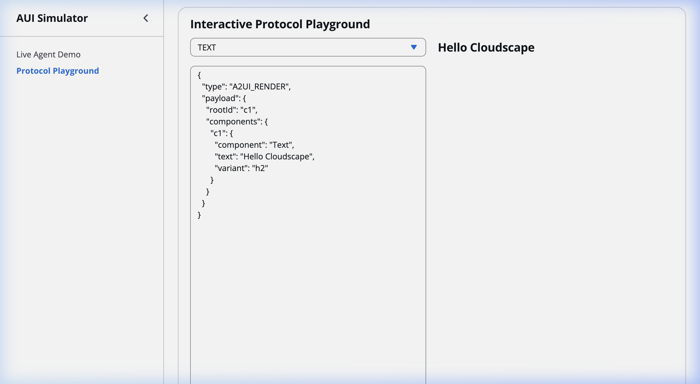
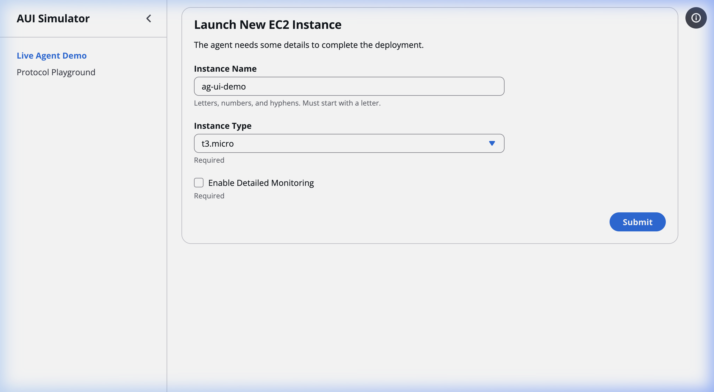
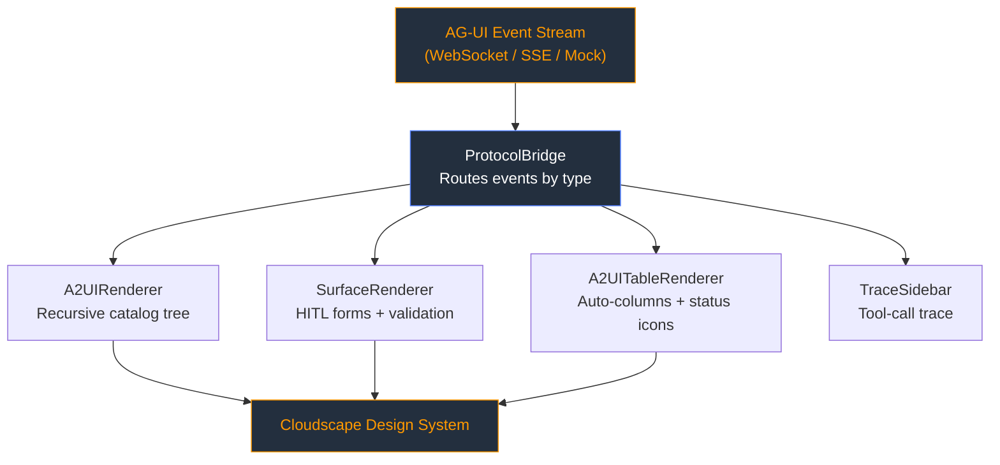

# AUI Cloudscape Renderer

[](https://github.com/golevishal/aui-cloudscape-renderer/actions/workflows/ci.yml)
[](./LICENSE)
[](https://www.typescriptlang.org/)
[](https://react.dev/)

A reactive rendering engine that bridges the [A2UI Protocol](https://a2ui.org/) with the native [AWS Cloudscape Design System](https://cloudscape.design/). Feed it strict JSON event payloads — get production-grade, enterprise-quality UI components in return.

---

## Screenshots

### Protocol Playground
Edit A2UI JSON payloads in real time and watch them render as native Cloudscape components:



### Live Agent Demo
Human-in-the-loop form interactions powered by `ACTION_REQUIRED` events:



---

## Features

| Feature | Description |
|---|---|
| **ProtocolBridge** | Routes `A2UI_RENDER`, `ACTION_REQUIRED`, `STATE_DELTA`, `TOOL_CALL_START`, and `DATA_MODEL_UPDATE` events to their matching presentation layers |
| **A2UIRenderer** | Recursive dictionary parser targeting the [A2UI v0.9 Basic Catalog](https://a2ui.org/specification/v0_9/json/basic_catalog.json) — maps 15+ layout & primitive components 1:1 to Cloudscape |
| **A2UITableRenderer** | Auto-generates columns, paginated sorting, and converts status strings (e.g. `"Success"`, `"Failed"`) to native `<StatusIndicator>` icons |
| **SurfaceRenderer** | Bidirectional HITL form engine with field-level validation (regex, min/max length, required) and `USER_RESPONSE` event emission |
| **A2UIPropertyRedact** | Click-to-reveal security wrapper that protects sensitive tokens from shoulder surfing |
| **Multi-Surface Routing** | Events can target `main`, `tools`, or `navigation` surfaces via the `surface` property |
| **Reactive Data Binding** | `$/path/to/value` expressions in component text resolve live from `DATA_MODEL_UPDATE` events |
| **Protocol Playground** | Dual-panel dev tool at `/playground` — edit JSON payloads and see all 18 mapped A2UI components render instantly |

---

## Quick Start

```bash
# Install dependencies
npm install

# Start the dev server
npm run dev
```

Open your browser:

| Route | What it does |
|---|---|
| `http://localhost:5173/` | Live agent demo — simulates real-time HITL interaction with temporal delays |
| `http://localhost:5173/playground` | Interactive JSON playground — test any A2UI payload against the renderer |

---

## Usage Example

Send this JSON payload through the event stream and the renderer produces a native Cloudscape card with live-updating text:

```json
{
  "type": "A2UI_RENDER",
  "payload": {
    "surface": "main",
    "rootId": "statusCard",
    "components": {
      "statusCard": { "component": "Card", "child": "col" },
      "col":        { "component": "Column", "children": ["heading", "status"] },
      "heading":    { "component": "Text", "variant": "h2", "text": "Deployment Status" },
      "status":     { "component": "Text", "text": "$/deployment/message" }
    }
  }
}
```

The `$/deployment/message` expression binds reactively — when a `DATA_MODEL_UPDATE` event arrives with `{ "deployment": { "message": "Complete" } }`, the text updates in place without a re-render of the tree.

---

## Supported A2UI Catalog Components

### Layouts
`Row` · `Column` · `List` · `Card` · `Tabs` · `Modal`

### Primitives
`Text` · `Image` · `Icon` · `Button` · `Divider`

### Inputs
`TextField` · `CheckBox` · `ChoicePicker` · `DateTimeInput`

### Specialized
`Table` (auto-columns, status indicators) · `PropertyRedact` (sensitive data)

---

## Architecture



Built with **Vite**, **React 19**, **TypeScript 5.9**, and `@cloudscape-design/components`.

| File | Role |
|---|---|
| `src/types/agui.ts` | Strictly typed AG-UI event and A2UI catalog interfaces |
| `src/hooks/useAgUiEvents.ts` | Mock event stream (see inline docs for real integration guide) |
| `src/components/ProtocolBridge.tsx` | Central event router |
| `src/components/A2UIRenderer.tsx` | Recursive catalog renderer |
| `src/pages/Playground.tsx` | Interactive dev playground |

---

## Development

```bash
# Lint
npm run lint

# Run tests
npx vitest run

# Run tests in watch mode
npx vitest --watch

# Type check
npx tsc --noEmit

# Production build
npm run build
```

---

## Integrating with a Real Backend

The mock hook (`useAgUiEvents.ts`) documents a complete SSE integration example in its JSDoc header. The `ProtocolBridge` component is transport-agnostic — it accepts:

```ts
interface ProtocolBridgeProps {
  events: AgUiEvent[];
  emitEvent: (event: OutboundClientEvent) => Promise<void>;
}
```

Swap the event source, keep the renderer.

---

## Contributing

Contributions are welcome! See [CONTRIBUTING.md](./CONTRIBUTING.md) for guidelines on filing issues, submitting PRs, and coding conventions.

## License

[MIT](./LICENSE) © Vishal Gole
